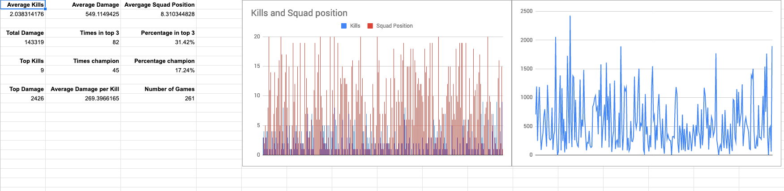
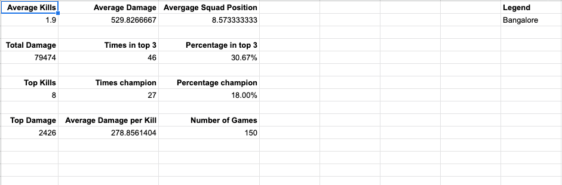

# Apex Stats

A small tool to log match results in [Apex Legends](https://www.ea.com/en-gb/games/apex-legends).

## How to install

1. Grab the latest release from [releases](https://github.com/k0nserv/apex-stats/releases).
2. Create a folder somewhere on your computer e.g. `C:\Program Files\apex-stats`.
3. Add the program in the folder.
4. Add the folder to your `PATH` as described [here](https://www.computerhope.com/issues/ch000549.htm).

## Add an entry

1. Press `win + r`, type cmd, and hit enter.
2. Type `apex-stats` and fill in the values. If you make a mistake press `ctrl + c` to abort.

**Example entry:**

```
Number of kills: 3
Damage dealt: 1337
Squad Position: 1
Legend: Wraith
Squad makeup: trio
Notes: Hey we won one!
```

> For squad makeup the values `solo`, `duo`, and `trio` are supported.


The log file is a CSV located in `%AppData%\Roaming\apex-stats\data\log.csv`.

## Analysis

1. Create a copy of [this Google Sheet](https://docs.google.com/spreadsheets/d/1jwJHUUX-3V9DoTIEpgJiqv440OgFZQmbKqvrNp_-Jq0/edit?usp=sharing).
2. On the `Data` sheet use `File > Import` to import the log. Select `Replace current sheet`.


**Stats overview:**



**Individual legend stats:**


